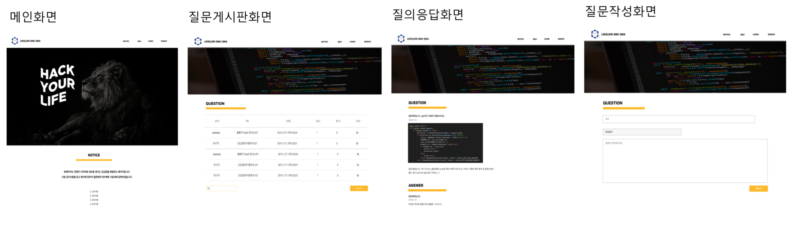

# Likelion_QnA

## Intro
멋쟁이사자처럼 8기 질의응답 서비스입니다.


# Developer
Guinness

# Tech Stack
**Back-end** : DRF(Django Rest Framework)<br>

## Getting Started
-가상환경 설치
```python
python -m venv (venvname)
source (venvname)/bin/activate
```
-필요 라이브러리 설치
```python
pip install -r requirements.txt
```
